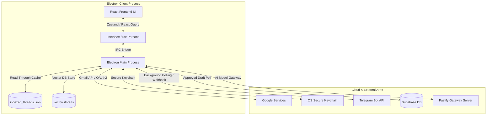

# ✉️ QuikMail — Premium Cross-Platform Desktop Email Client

QuikMail is a high-performance, intelligent desktop email client powered by **local RAG (Retrieval-Augmented Generation) vector databases**, an **ultra-fast read-through caching engine**, and an interactive **Telegram Notification Triage Concierge**. It combines fluid design principles with AI integrations to make email management lightning fast and contextual.

---

## ✨ High-Level Features — "Cursor for Email"

QuikMail is built to feel like **Cursor for email**, heavily customized for your daily workflow:

*   **Context-Aware AI Sidebar**: Open any email thread and instantly get a quick summary, reply suggestions, or actionable task items streamed right in your sidebar.
*   **Natural Language Email Search**: Forget complex query tags. Instantly search your inbox using natural phrases like *"billing emails"*, *"interview mails"*, or *"emails from HR"*.
*   **One-Click AI Reply Drafting & Sending**: Open an email, click **Draft Reply**, review the generated HTML preview, and hit send immediately.
*   **RAG-Powered Email Writing**: Ground your drafts in real personal files. Upload your resume or job descriptions and prompt: *"write a mail for this job"*.
*   **Personalized Tone Presets**: Seamlessly adjust replies to sound more *formal*, *concise*, *friendly*, or match your usual writing style.
*   **Chat-to-Compose Emails**: Type natural commands like *"send an email to John about tomorrow's meeting"* and the assistant automatically pre-fills the recipient, subject line, and draft details.
*   **Smart Auto-Categorization**: Sort incoming emails automatically into dynamic category folder pills (e.g. *Job Applications*, *Billing*, *Newsletters*, *Personal*) using custom natural language sorting instructions.
*   **Meeting Detection & Export**: If the AI detects phrases like *"let's meet tomorrow at 5"*, it suggests creating a meeting event and exports standard `.ics` calendar cards.
*   **Telegram Email Concierge**: Get real-time critical priority updates like *"Interview mail received - action needed"* straight to your Telegram app without opening your inbox, and approve AI drafts on-the-go.
*   **Keyboard Command Palette (`Cmd+K`)**: Use universal developer shortcuts to run actions like `/search billing`, `/summarize`, or `/compose` instantly.

---

## 🎨 System Architecture

The project is organized as a monorepo consisting of two primary components:
1. **Client (`/client`)**: An Electron-based desktop application built using React, Vite, TypeScript, TanStack React Query, Zustand, and Tailwind CSS.
2. **Server (`/server`)**: A Fastify-based backend gateway serving as an secure conduit for model inference, text parsing, and authentication handshakes.



---

## ⚡ Core Feature Highlights

### 1. Near-Instant Read-Through Cache Performance
- **0ms Loading for Synced Mail**: Leverages the local indexed metadata store (`indexed_threads.json`) in the main process to cache thread listings.
- **Scroll Latency Eliminated**: Compares Gmail API message IDs against the cache. Cached threads render **instantly**, dropping infinite scroll and page fetch latency down to **100–150ms** (a single ID fetch) instead of heavy concurrent metadata network roundtrips.
- **Dynamic Classification Overlays**: Dynamically overlays dynamic triage categories and colors onto cached threads at runtime.
- **Real-Time Action Synchronization**: Star, unstar, archive, and trash actions instantly write back to the local metadata cache to prevent stale rendering.

### 2. Local RAG (Retrieval-Augmented Generation) Knowledge Base
- **Multi-Source Indexing**: Index PDFs (resumes, guidelines, flyers) or custom text chunks.
- **Vector Embeddings Database**: Breaks down files using a text chunker and computes high-dimensional vectors locally to index them in an offline vector store (`vector-store.ts`).
- **Hallucination-Free Drafts**: Semantic facts lookups (`retrieveForQuery`) inject exact verified snippets matching your prompt into the LLM context, grounding generated email drafts in real personal data.

### 3. Spotlight Keyboard Command Palette (`Cmd+K`)
- **Spotlight dialog**: Triggered globally via `Cmd+K` keyboard shortcut with a premium frosted glass backdrop and indexable autocomplete selection list.
- **Quick Slash Executions**:
  - `/search [query]`: Instant universal semantic search across all emails.
  - `/reply [tone] [instructions]`: Opens the reply composer preloaded with active recipient details and custom drafting instructions matching a selected **Tone Preset** (*friendly*, *concise*, *formal*).
  - `/summarize`: Opens the AI Assistant and starts streaming an aggregated summary of the active thread.
  - `/compose`: Opens a blank composer.
  - `/settings` & `/theme`: Direct shortcuts to open settings tabs or toggle appearance themes instantly.

### 4. Context-Aware Dual-Search Engine (`Cmd+F`)
- **Global Search Overlay**: Accessible via `Cmd+F` or the header search wheel, complete with conceptual search recommendations.
- **Context-Aware Server Keyword Search**: Runs the `'mail:search'` IPC channel that queries Gmail's server-side endpoint `/messages?q=...` while automatically respecting your current active folder tab (e.g. Sent, Inbox, Archive, Trash).
- **Parallel Conceptual Semantic Search**: Queries the local vector database of email chunk embeddings in parallel.
- **Unified Merge**: Merges duplicate results uniquely by ID, sorts them chronologically by date, and displays them inside both the search modal dropdown and the main side panel list.

### 5. Interactive Streaming AI Composer (`Cmd+L`)
- **AI Panel Sidebar**: Toggleable side panel container (`Cmd+L`) for conversational AI drafts generation.
- **Indeterminate Progress Bar**: Pulses a thin animated progress line below the header when background RAG queries or triage classifications are processing.
- **Real-Time Headers SSE Parser**: Decodes Server-Sent Events (`stream: true`) to stream LLM responses chunk-by-chunk. Parses incoming streams to live-extract `Recipient-To` and `Subject` headers *during streaming* to populate the grid instantly.
- **Live Typing Cursor**: Appends a pulsing vertical insertion cursor (`|`) to the end of active streams.

### 6. Grounded Composer & MIME Multipart Attachments
- **RAG Facts Previewer**: A collapsible panel inside the composer that lets you preview matched vector chunks before writing, ensuring absolute factual control.
- **Standard MIME Mixed transmission**: Compiles standard RFC-2822 HTML and base64 multipart MIME messages to deliver real file attachments (PDFs, flyers) directly from the client.
- **Dual-Mode Attachment Management**: Add/delete file attachments in both edit and view mode, featuring a view-mode paperclip and visual attachment pills.

### 7. Telegram Notification Triage Concierge
- **Background Urgency Filter**: Polling worker pulls new email IDs every 7 seconds and classifies urgency using an LLM.
- **Markdown Alert Webhook**: If classified as critical, sends a rich markdown payload (From, Subject, Urriage Reasoning, and a professional 2-3 sentence AI summary) directly to your Telegram Bot.
- **Supabase DB Offline Resilience**: Catches database exceptions. Bypasses paused Supabase instances to deliver critical Telegram alerts directly, guaranteeing zero downtime.
- **Remote Approval Send Loop**: Polls Supabase for emails marked as "approved" from your Telegram Bot interface, automatically sending the drafted reply **directly from your Gmail account** via Gmail's send API and showing a native OS desktop notification ("✉️ Telegram Reply Sent!").

---

## 🛠️ Getting Started

### Prerequisites
- [Node.js](https://nodejs.org/) (v18 or higher recommended)
- [PNPM](https://pnpm.io/) (v10 or higher recommended)
- A Google Account (with Gmail API access configured)

### Setup & Credentials Configuration
1. Configure your Google OAuth2 client credentials in `client/src/main/auth/google.ts`.
2. Connect your secure tokens, Telegram Bot Token, and Chat ID under the **AI Settings** and **Triage & Logs** tabs in the settings panel.

### Installation
From the project root directory, install all dependencies:
```bash
# Install dependencies for both client and server
pnpm install
```

### Running in Development
Run the Fastify server and the Electron-Vite development process:
```bash
# Start Fastify AI Gateway Server
cd server
pnpm dev

# Start Electron Client Application (from another terminal)
cd client
pnpm dev
```

### Compiling for Production
Compile, bundle, and package the Electron installer executable:
```bash
# Compile and build assets for production
cd client
pnpm build

# Compile, build, and package the Electron installer executable
pnpm package
```

---

## 🧬 IPC Channels Blueprint

QuikMail coordinates communication between the Electron frontend and the backend main process via a robust IPC channel registry:

| IPC Channel | Payload Schema | Action Performed |
| :--- | :--- | :--- |
| `mail:list:inbox` | `(args?: { maxResults?: number; pageToken?: string })` | Fetches Inbox threads utilizing the read-through cache |
| `mail:list:folder` | `(args: { folder: FolderType; maxResults?: number })` | Fetches Folder threads utilizing the read-through cache |
| `mail:get` | `(id: string)` | Retrieves full thread message body parsed with HTML sanitization |
| `mail:search` | `(args: { query: string; folder?: string })` | Context-aware Gmail server-side query keyword search |
| `ai:search` | `(args: { query: string })` | Conceptually scans local email vector index embeddings |
| `ai:stream` | `(args: { prompt: string; streamId: string })` | Streams generated drafts with real-time RAG fact injections |
| `mail:star` / `mail:unstar` | `(args: { id: string })` | Star/unstar Gmail thread and synchronizes local metadata cache |
| `mail:archive` / `mail:trash` | `(args: { id: string })` | Archive/trash Gmail thread and synchronizes local metadata cache |

---

## 📄 License
This project is licensed under the ISC License.
